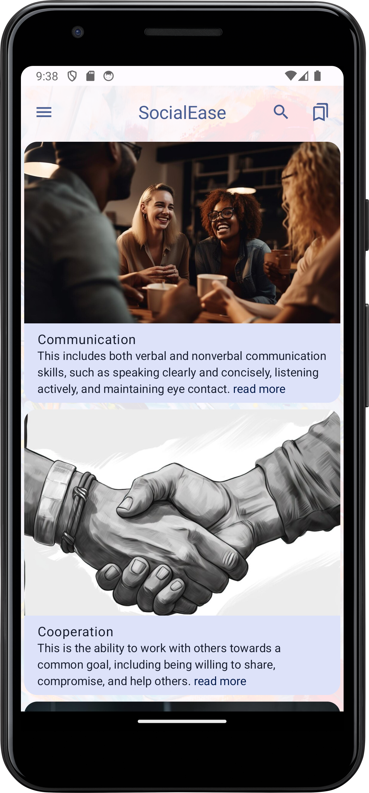

**SocialEase** is a native Android app designed to enhance social skills using Jetpack Compose. Features include Introduction Screen, Authentication, Profiles, Bookmarks, Search, and Share functionalities.

  

## Features

- **Introduction Screen:** Engage users with an informative introduction.

- **Authentication and Profiles:** Implement secure user authentication. Allow users to create and manage profiles.

- **Bookmarks Feature:** Enable users to save and organize social skills notes.

- **Search Feature:** Facilitate efficient content discovery.

- **Share Feature:** Enhance user engagement by incorporating a share feature.

## Technologies

- **Google Identity Integration:** Integrate Google Identity for seamless and secure authentication.
  
- **Firebase:**
  - *Firebase Authentication:* Utilize Firebase for secure user sign-up and login, supporting various authentication methods.
  - *Realtime Database or Firestore:* Choose between Firebase Realtime Database and Firestore for real-time data storage.

- **Jetpack Compose:** Implement the modern Android UI toolkit for flexible UI design.

- **Coroutines:** Incorporate Kotlin Coroutines for efficient asynchronous programming.

## Installation

Follow these steps to run the project locally:

1. Clone the repository:
   `git clone https://github.com/SamuelWakoli/SocialEase.git`

2. Open the project in Android Studio.

3. Configure Firebase:
   - Create a new Firebase project on the [Firebase Console](https://console.firebase.google.com/).
   - Add your Android app and download the `google-services.json` file.
   - Place the file in the `app` directory.

4. Build and run the app on an Android emulator or device.

## Contributing

We welcome contributions! Follow these steps to contribute:

1. Fork the repository.

2. Create a new branch for your feature or bug fix:
   `git checkout -b feature/new-feature`

3. Make changes and commit:
   `git commit -m "Add new feature"`

4. Push your branch to your fork:
   `git push origin feature/new-feature`

5. Create a pull request to the `main` branch.
---

