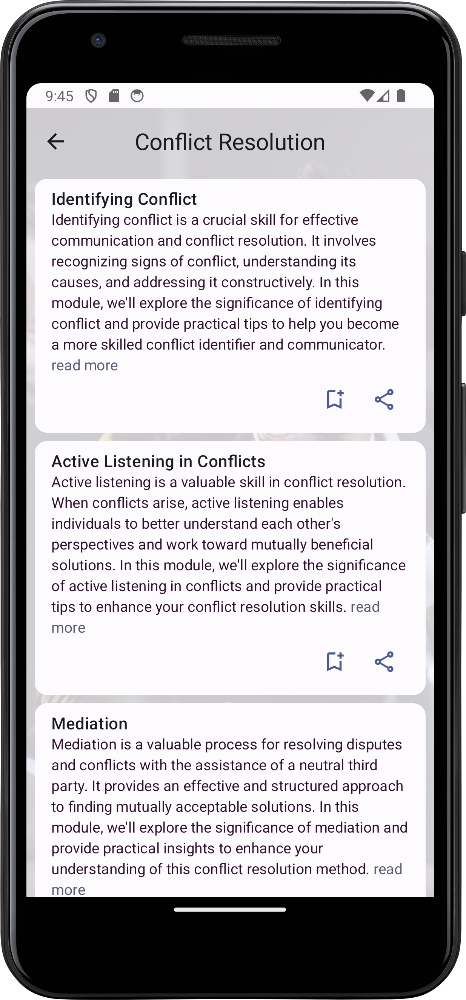

# SocialEase

**SocialEase** is a native Android app built with Jetpack Compose, designed to help users improve their social skills by providing content on various topics. It includes features such as an Introduction Screen, Authentication and Profiles, and Bookmarks functionality.

## Features

### Introduction Screen
- Engage users with an informative introduction to the app.
- Provide a warm welcome and guide them through the app's offerings.

### Authentication and Profiles
- Implement secure user authentication to protect user data.
- Allow users to create and manage profiles, enabling a personalized experience.

### Bookmarks Feature
- Enable users to bookmark and save their favorite social skills notes.
- Easily access and organize saved content for future reference.

## Technologies

### Firebase

#### Firebase Authentication
Utilize Firebase Authentication to implement secure user sign-up and login functionalities, ensuring robust data security and access control. This service provides various authentication methods, including email/password, phone number, and third-party identity providers such as Google, facilitating a seamless and secure authentication process.

#### Firebase Realtime Database or Firestore
Choose between Firebase Realtime Database and Firestore to store user profiles and bookmarks. Both databases offer real-time data synchronization and scalability. Firebase Realtime Database is a NoSQL cloud database that enables the synchronization of data in real-time, while Firestore provides a more flexible and scalable NoSQL database with additional features like richer queries and built-in offline support.

### Jetpack Compose

Implement the latest Android UI toolkit, Jetpack Compose, for building native user interfaces. Jetpack Compose allows for a more modern and flexible UI design approach, leveraging a declarative syntax to simplify UI development. It enhances code readability and maintainability, providing a more efficient way to create and update user interfaces.

### Coroutines

Incorporate Kotlin Coroutines into your application for asynchronous programming. Coroutines simplify the management of asynchronous tasks, making it easier to write and maintain asynchronous code. They provide a structured concurrency model, making it more straightforward to handle background tasks without compromising code readability or performance.

### Google Identity Integration

Integrate Google Identity for a seamless and secure authentication experience. Google Identity allows users to sign in using their Google accounts, enhancing user convenience and providing a trusted authentication method. By leveraging Google Identity, you can extend authentication capabilities beyond email/password combinations, offering users a familiar and reliable sign-in option.

Feel free to customize the descriptions based on your specific use case and preferences.

## Installation

To run this project on your local development environment, follow these steps:

1. Clone the repository to your machine:
   `git clone https://github.com/SamuelWakoli/SocialEase.git`

2. Open the project in Android Studio.

3. Configure Firebase:
- Create a new Firebase project on the [Firebase Console](https://console.firebase.google.com/).
- Add your Android app to the project and download the `google-services.json` file.
- Place the `google-services.json` file in the `app` directory at the project.

4. Build and run the app on an Android emulator or physical device.

## Contributing

We welcome contributions from the open-source community. If you'd like to contribute to this project, please follow these guidelines:

1. Fork the repository.

2. Create a new branch for your feature or bug fix:
   `git checkout -b feature/new-feature`

3. Make your changes and commit them:
   `git commit -m "Add new feature"`

4. Push your branch to your fork:
   `git push origin feature/new-feature`

5. Create a pull request to the `main` branch of this repository.

---

## Screenshots (Compact)

  

